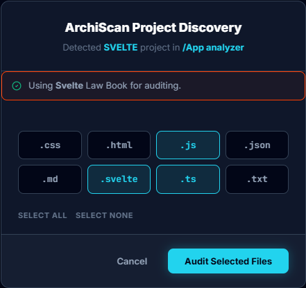
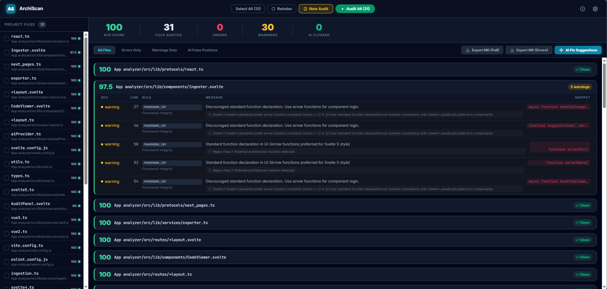

# 🚀 ArchiScan (2026 Edition)

**Stop guessing if your code is clean. Let the AI Judge prove it.**

This is a browser-based workbench that audits your projects against strict architectural "Laws." It uses a 3-pass precision engine (Regex + AI + Senior Judge) to find logic leaks, structural debt, and framework misuse.

---

### 📢 A Note from the Author
This is my first-ever open-source project on GitHub.
- **Maintenance Status:** I do not intend on maintaining this tool for the public. I built it for my own needs, and it works surprisingly well—it helped me fix the structure of 5 of my own projects.
- **Your Turn:** If you find bugs or want new features, please **fork it** and make it your own. I'm sharing this as-is because I think the logic is valuable, but I won't be providing support or updates.
- **Zero F***s Given:** Break it, steal the logic, or refactor it into something else. I just wanted to build something that actually works. If it helps you, awesome.

---
### ⚠️ WORD OF CAUTION: Token Usage & Scaling
ArchiScan is a powerful, deep-scanning tool, but it is **hungry for tokens**. 

- **The Stress Test:** During development, this tool was tested on a project with **250+ files and ~45,000 lines of code**. 
- **The Bill:** That single audit consumed approximately **200,000 tokens** using the Gemini 3.1 Flash model.
- **How it works:** ArchiScan indexes everything you select, prunes comments to save space, and then "Lego-batches" files in groups of 15 to the AI.
- **Recommendation:** 
    - **Do NOT** run this on massive, million-line enterprise projects unless you have a deep wallet.
    - **Avoid** using expensive models (like Claude 4.6 ) for the initial full-project sweep unless necessary.
    - **Pro Tip:** Use the **Free Tier of Google AI Studio (Gemini API)**. It works brilliantly, handles the volume, and won't cost you a cent. 

---

### 🔥 Killer Features
- **Lego Batching:** Bundles violations to save you money and API tokens.
- **The Senior Judge:** A second AI pass that removes false positives (it won't yell at you for "Visual Math").
- **Multi-Framework Protocols:** Specialized "Law Books" for Svelte, React, Vue, and Next.js.
- **Privacy First:** Your API keys and source code **never** leave your browser. Everything stays in your local IndexedDB.

---

### 🛠️ How to use it (The "Non-Coder" Friendly Guide)
1. **Clone the repo.**
2. `npm install -->> npm run dev`.
3. **Add your API Key** (Gemini / Claude / OpenRouter) in the Settings UI.
4. **Drop a project folder** into the Ingester.
5. **The Workflow:** Audit -> Download Error files or Copy Fix Report -> Paste into your AI (Trae / Cursor / Windsurf / VSCode / Claude) -> Fix.

---

### 💻 Tech Stack
- **Framework:** Svelte 5 (Runes Mode)
- **Database:** IndexedDB (via `idb` library)
- **AI Integration:** Gemini, Claude, and OpenRouter
- **Styling:** Tailwind CSS v4

---

### 🤝 Contributing & Forking
Since I am not maintaining this project, the best way to contribute is to **fork the repository**. Use the "Senior Judge" prompts or framework protocols as a starting point for your own custom architectural tools.
